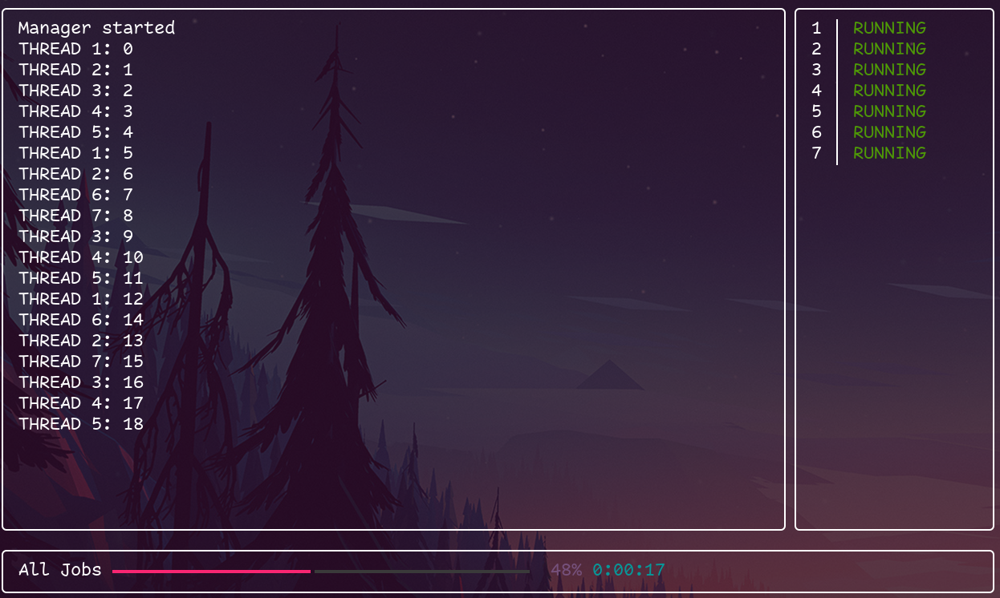

# rich-thread-manager

I find myself running bulk activities frequently.
So I created this package as a quality of life improvement.
It allows me to manage threads with a queue on the fly by adding/removing threads on demand.

## Quick start

Installation:

```text
git clone https://github.com/hosler/rich-thread-manager.git
cd rich-thread-manager
pip install .
```

Simple example to load a thread and a queue. 
`=` will add a thread to the pool and `-` will remove a thread:

```python
import time, logging, queue, threading
from queue import Empty

from rtmui.threading import RTMThread
from rtmui.manager import Manager

main_logger = logging.getLogger()
main_logger.setLevel(logging.DEBUG)

class DumbThread(RTMThread):
    def run(self):
        while True:
            try:
                thing = self.queue.get(timeout=5)
            except Empty:
                break
            time.sleep(5)
            self.logger.info(f'THREAD {self.id}: {thing}')
            self.queue.task_done()
            if self.stop:
                self.logger.info(f'THREAD {self.id}: SIGNING OFF')
                break


queue = queue.Queue()

for counter in range(40):
    queue.put(counter)

manager = Manager(main_logger, queue, DumbThread)
manager.run()
```

## Notes
I sugguest running python with an unbuffered stdout to avoid write blocks:

```text
python -u uitest.py
```

## Screenshots
